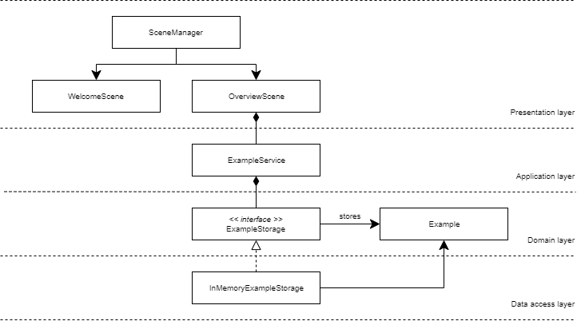
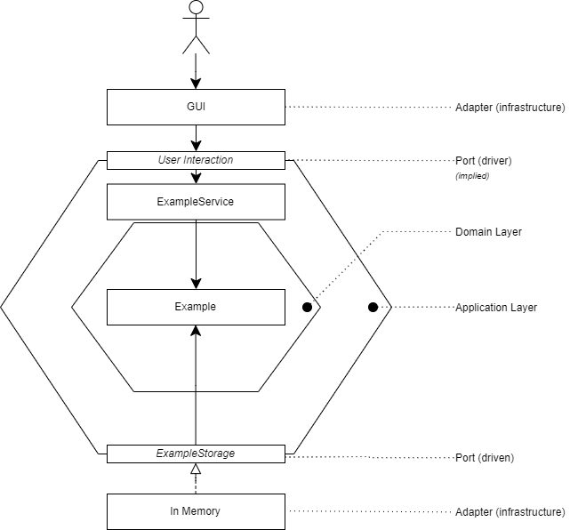

# Example JavaFX project
An example project for dealing with JavaFX.
This project is part of instructions 
for the course Patterns and Frameworks 
at the Hogeschool Utrecht, but could
be useful to anyone.

The project has a simple domain:
storing (and deleting) unique phrases, called Examples.

Its goals are to illustrate how to setup JavaFX
using maven and Spring Context
and keep the architecture somewhat tidy.

[Maven](https://maven.apache.org/what-is-maven.html) 
is used for installing third party dependencies
and running the application using the 
[JavaFX plug-in](https://github.com/openjfx/javafx-maven-plugin).

[Spring Context](https://docs.spring.io/spring/docs/3.0.x/spring-framework-reference/html/beans.html) 
is used for wiring up dependencies using beans
within the application. We have configured
FXML to use Beans from our custom `AppConfig`
as well by configuring its factory: 
`fxmlLoader.setControllerFactory(context::getBean);`.

For a more thorough example, see the `SceneManager`
within this project.

## Initial setup
Get the required dependencies by installing them
through maven, either by doing so via the IDE
of your choosing or by running the following
in your terminal (CLI):
```
mvn clean install
```

## Running the application
Running the application through `Main::main()`
or `Main::start()` won't work, as this
requires some explicit 
[module magic](https://github.com/openjfx/samples/blob/master/CommandLine/Modular/Maven/hellofx/src/main/java/module-info.java),
which has not been done in this project
(you could try it for yourself).

You can run the application during development
through maven, either by doing so via the IDE
of your choosing or by running the following
in your terminal (CLI):
```
mvn clean javafx:run
```

Note that you can configure your IDE to run
two maven commands when the "start" button
is pressed.

## Adding more frameworks or libraries
You can add more frameworks or libraries
via Maven by registering them 
as extra dependencies
in your `pom.xml` and running `mvn install`. 
This can also be done via the IDE 
or editor of your choosing.

Third-party frameworks or libraries 
can be found through 
[Maven Central](https://mvnrepository.com/repos/central).
More information can be found on the
[maven website](https://maven.apache.org/guides/getting-started/maven-in-five-minutes.html).

Don't forget to 
read the instructions on the website or 
repository of the library you would
like to use.

## Architecture
The chosen application architecture can
be pictured as a layered architecture,
separating the *domain*, *application*
and the *infrastructure*. The *infrastructure*
consists of GUI components responsible for the
*presentation* and a storage implementation
responsible for *data access*.

The architecture can be sketched
as the following *layered architecture*:



From this image, we can see that every layer
has its own responsibility and its own level
of abstraction.

In a more conceptual sense, the principles
of *Ports and Adapters (Hexagonal Architecture)*
are followed. We have an application core,
consisting of an abstract domain which is exposed
through orchestrating application services and
ports that allow varying implementations.
The concrete implementations, the adapters
for our ports, are labeled as infrastructure.

This can be sketched out as follows:



From this view, it is clear that our driving adapters
can be varied (they only need to talk to the example
service) and our driven adapters can vary as well
(the offered interfaces can be implemented differently).

## Author
Alex Rothuis: [@arothuis](https://twitter.com/arothuis)

[arothuis.nl](http://arothuis.nl)